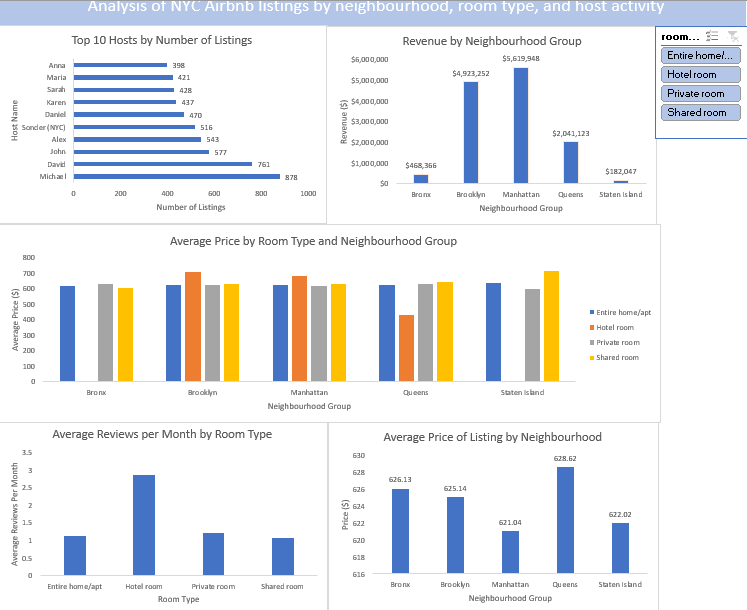

# Airbnb NYC Listings Analysis

## Overview:
This project analyzes Airbnb listings in New York City to examine pricing patterns and host activity. The dashboard was built on excel and can be used to provide insights for hosts as well as users of the Airbnb platform.

## Business Objective

To identify key trends in Airbnb rentals across New York City, including revenue by neighbourhood group, top hosts by listings, and average prices by room type.  

## Dataset
- **Source:** [Airbnb NYC Listings Dataset](https://www.kaggle.com/datasets/dgomonov/new-york-city-airbnb-open-data)  
- **Key Fields:** Include neighbourhood group, room type, reviews per month, price, availability 365, revenue

## Download dashboard

[Download the Airbnb listings analysis dashboard (.xlsx)](https://drive.google.com/file/d/1V0xo92O1DK9Uyf7LwFvb5qCnuEaBxuI7/view?usp=drive_link)

- The dashboard sheet will open by default but supporting pivot tables and data sheets are hidden for clarity, but can be unhidden
  
## Dashboard Preview

## Key Insights

- Neighborhood Trends: Manhattan dominates in listing count and revenue, while Staten Island and the Bronx provide the lowest values in terms of number of listings and revenue.
- Room Type Patterns: Entire homes/apartments account for the majority of revenue, while hotel rooms account for the least total revenue.
- Host patterns: There is a signficant imbalance in top hots by listings, with 10-15 hosts accountign for the bulk of the number of listings

## Sections of the report
- The report data contains a slicer so you can filter by room type: Entire home, hotel room, private room, and shared room.
- The report is made up of 5 bar charts: Top 10 hosts by number of listings, Revenue by neighbourhood group, Average price by room type and neighbourhood group, Average price by room type and neighbourhood group, Average reviews per Month by room type, Average price of listing by neighbourhood group
- A collection of pivot tables providing summary data on the dataset.
  
 ## Skills used
- Pivot tables
- Dashboard Design using excel
- Data cleaning in SQL and excel

